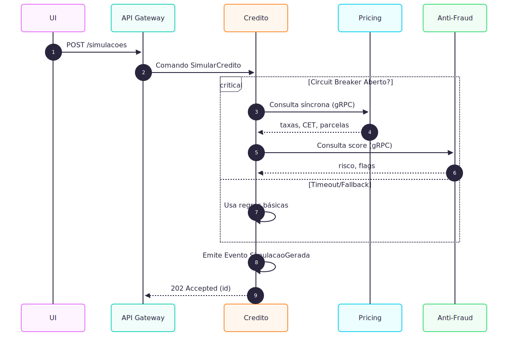
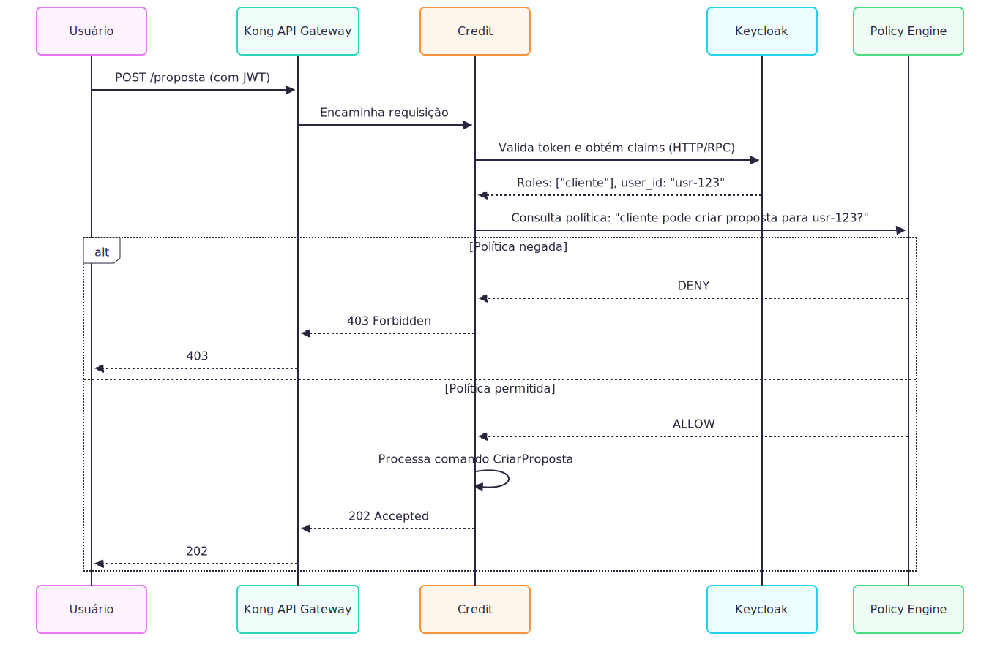
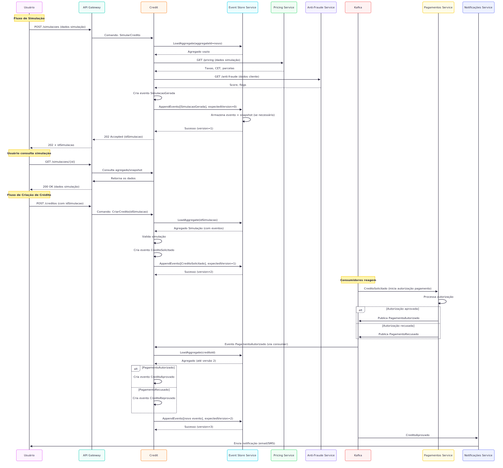

# Arquitetura do Sistema de Crédito (DDD + Event Sourcing)

## 1. Contexto Rápido
**Domínio Principal**:  
`Crédito` (agregado `Credito`) - ciclo de vida completo de empréstimos.

**Subdomínios Estratégicos**:
- `Precificação`: Motor de pricing com ML + regras
- `Anti-Fraude`: Avaliação de risco em tempo real
- `Pagamento Recebidos`: Integração com servicos de pagamento
- `Pagamento Enviados`: Integração com servicos de pagamento
- `Notificações`: Comunicação assíncrona com usuários
- `Identidade & Acesso`: Gestão de autenticação/autorização

## 2. Limites de Domínio

| Bounded Context |                     Responsabilidade                     | Padrão Integração |
|:---|:--------------------------------------------------------:|---:|
| Credito (Core) | Ciclo de vida do crédito (abertura, execução, simulação) | Texto |
| Pricing |               Cálculo de taxas e parcelas                | Síncrono (gRPC) |
| Anti-Fraude |                Score de risco e validação                | Síncrono (gRPC) |
| Pagamentos |                Conciliação com PSPs              | Assíncrono (Kafka)|
| Identidade |                Autenticação/OAuth2              | Síncrono (OIDC)|

## 3. Fluxos Principais

### 3.1 Simulação Síncrona Resiliente

### 3.2 Incluindo fluxo de authZ/AuthN

### 3.3 Fluxo completo

#### 3.4 Explicação do Fluxo Completo

- Passo 1: Usuário inicia uma simulação via API
- Passo 2: O Credit carrega um novo agregado (vazio) do Event Store
- Passo 3: Serviços externos (Pricing e Anti-Fraude) são consultados
- Passo 4: Evento SimulacaoGerada é armazenado e publicado
- Passo 5: Após simulação concluida, o usuario comanda 'CriarCredito' a partir da sumulacao gerada.
- Passo 5: Valida no dominio e cria a solicitação, se aprovada o sistemas de pagamento reagem.
- Passo 6: Após as solicitação de pagamento authorizado, cria o evento de credito aprovado e finaliza o processo

## 4 Padrões de Projeto e Boas Práticas

### 4.1 Padrões de integração e resiliência (sync)

**Para integrações síncronas (precificação, anti-fraude)**:

- `Circuit Breaker`: Seu serviço corta chamadas a um parceiro após X falhas, evitando piorar servicos com problemas e gargalo.
- `TimeLimiter (timeout)`: Cada chamada tem um tempo para processar.
- `Retry com backoff`: Retentativas limitadas com pausa exponencial.
- `Bulkhead`: Isolar pools (threads/connection pools) para que chamadas lentas não esgotem recursos do processo.
- `Fallbacks`:  Comportamento degradado quando upstream não responde (ex.: regras base para pricing ou fallback para outro provedor de anti-fraude).
- `Observability`: Monitorar estados do breaker, latências por parceiro, taxa de fallback, e alertar quando > threshold.

### 4.2 Arquitetura CQRS + Deployments separados
- `CQRS`: Separar o modelo de escrita (commands) do de leitura (queries).
- `Deployments separados`: Cada tipo de serviço tem seu próprio ciclo de deploy e escalonamento:

- Command service escala por métricas de escrita(Requisicoes http, p95 de resposta).
- Query service (API de leitura) escala por métricas de leitura (Requisicoes http, p95 de resposta).
- Event processors / projections (consumidores) escalados por backlog/lag de tópico (mensagens pendentes).
- **Benefício: escalabilidade independente; falhas isoladas**
- **Trade-offs**: Mais pipelines e monitoramento.
